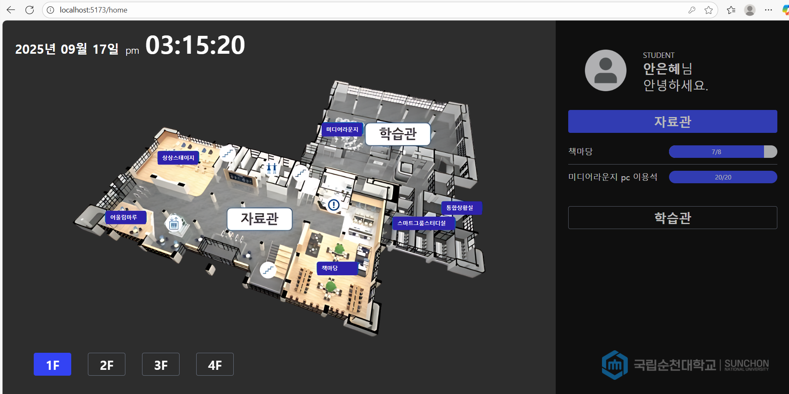

# 순천대학교 도서관 예약 시스템

**순천대학교 도서관을 보다 편리하게 이용할 수 있도록 돕는 통합 예약 시스템입니다.**  
좌석 예약, 열람실 확인, 예약 내역 조회 등을 간편하게 웹 상에서 처리할 수 있습니다.  
학생들이 더 효율적으로 도서관 시설을 사용할 수 있도록 설계되었습니다.

---

## 목표
좌석 예약, 열람실 확인, 예약 내역 조회 등을 간편하게 웹 상에서 처리할 수 있습니다.  
학생들이 더 효율적으로 도서관 시설을 사용할 수 있도록 설계되었습니다.
- 순천대학교 재학생을 위한 **열람실 좌석 예약 시스템** 제공
- 도서관 좌석 정보, 이용 가능 시간, 실시간 예약 현황 등을 **웹에서 확인 가능**
- **예약/취소 기능**을 포함한 사용자 중심의 편의 기능 구현
- **프론트엔드 + 백엔드 + DB 완전 연동**된 실제 서비스 형태 구현

---
## 실행 화면


---

## 기술 스택

### 프론트엔드
- **React** + **TypeScript** (Vite 기반 프로젝트 구성)
- **Zustand**: 상태 관리 라이브러리
- **Axios**: API 통신
- **Tailwind CSS**: 반응형 UI 스타일링

### 백엔드
- **Spring Boot**: RESTful API 서버 구축
- **JPA + MySQL (AWS RDS)**: 데이터베이스 및 ORM 사용
- **Spring Security** (선택): 사용자 인증 및 권한 관리

---

## 주요 기능

- **열람실 좌석 조회**  
  - 실시간 남은 좌석 확인
- **좌석 예약 및 취소 기능**  
  - 시간대별 예약 가능  
  - 중복 예약 방지 로직 포함
- **로그인 기능** (학생 인증)  
  - ID/PW 기반 로그인 또는 학번 인증 방식
- **예약 내역 확인**  
  - 사용자가 직접 자신의 예약 이력 확인 가능
- **모바일 및 데스크탑 지원**  
  - 반응형 UI 제공

---

## 파일 구조

```
├── frontend/ # React 프론트엔드
│ ├── src/
│ │ ├── components/ # UI 컴포넌트
│ │ ├── pages/ # 페이지 단위 구성
│ │ ├── stores/ # Zustand 전역 상태
│ │ ├── api/ # Axios API 함수
│ │ └── types/ # TypeScript 타입 정의
│ ├── public/
│ ├── package.json
│ └── vite.config.ts
├── backend/ # Spring Boot 백엔드
│ ├── src/
│ │ ├── controller/ # API 컨트롤러
│ │ ├── service/ # 비즈니스 로직
│ │ ├── repository/ # JPA Repository
│ │ ├── entity/ # 도메인 모델
│ │ └── config/ # 설정 파일 (보안, DB 등)
│ └── build.gradle
├── README.md
└── .gitignore
```

---

## 실행 방법

### 1. 백엔드 실행 (RestAPI)

```bash
cd backend
./gradlew bootRun
```

### 2. 프론트엔드 실행 (React)

```bash
cd frontend
npm install
npm run dev
```

---

## 데이터 소스

- 순천대학교 도서관 공식 홈페이지
